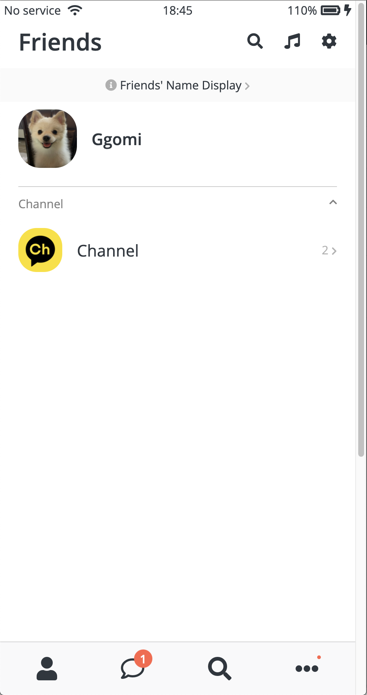
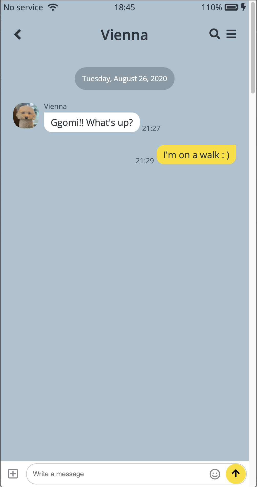

# KoKoaTalk
> A clone of the KaKaoTalk App on HTML5, CSS3✉

![HTML Version][html-image]
![CSS Version][css-image]

| friend_page |chat_page|
|:------------:|:-----------:|
 | 

## Feature
- [x] Just use html,css
- [x] The puppies are so cute.

## Take a look at my first clone page!!
[https://wookkl.github.io/kakao-clonecoding/](https://wookkl.github.io/kakao-clonecoding/)

[html-image]: https://img.shields.io/badge/html-v5-brightgreen
[css-image]: https://img.shields.io/badge/CSS-v3-orange